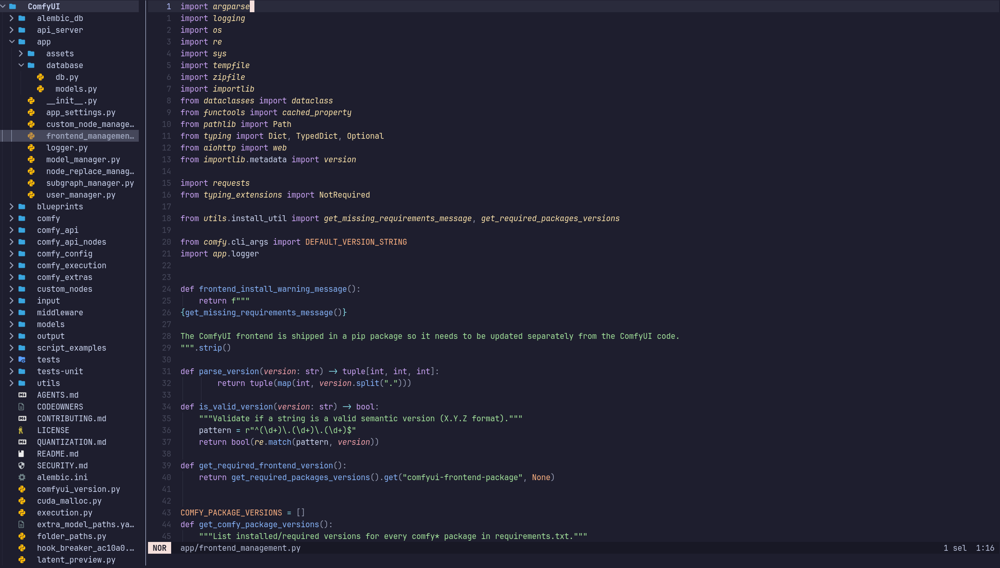

# canopy.hx

A better file tree for Steel-enabled Helix. Persistent docked sidebar,
defaults that are sane to me. WIP.



Forked from [forest.hx](https://github.com/Ra77a3l3-jar/forest.hx) (MIT) and
mostly rewritten: vim navigation that walks the whole tree, search that
filters the tree in place, file ops that keep open buffers pointed at the
right path, git status, mouse support.

Requires mattwparas' Steel-enabled Helix fork (branch `steel-event-system`).
It doesn't run on stock Helix, which has no plugin runtime.

Status: feature-complete for my daily use; but still WIP. The API may still shift.

## Install

You need the Steel fork of Helix and `forge`, Steel's package manager.
`install.sh` builds both from pinned revisions, then installs canopy.
Re-running it is safe; it skips whatever is already built.

Dependencies:

- git
- Rust 1.90+ ([rustup](https://rustup.rs); distro packages lag)
- a C compiler
- Linux: OpenSSL headers and pkg-config
- a Nerd Font, or the icons are boxes

| Platform | Install |
|----------|---------|
| macOS | `xcode-select --install` |
| Fedora | `sudo dnf install git gcc openssl-devel pkgconf-pkg-config` |
| Ubuntu / Debian | `sudo apt install git build-essential libssl-dev pkg-config` |
| Arch | `sudo pacman -S --needed git base-devel openssl pkgconf` |

```sh
git clone https://github.com/a-marr/canopy.hx.git
cd canopy.hx
./install.sh
```

What it does: installs `hx`, `forge`, and the Steel tools into `~/.cargo/bin`
(your distro or brew `hx` stays put, just make sure `~/.cargo/bin` wins on
PATH), links the Helix runtime, builds grammars, installs canopy and its deps,
and writes a starter `~/.config/helix/init.scm` if you don't have one. It
never touches an existing `init.scm`; it prints the snippet and you paste it.
Sources go in `~/.local/src/canopy-stack` (override with `CANOPY_SRC_DIR`).
Don't delete the Helix clone afterwards, the runtime symlink points into it.

Already on the Steel fork with `forge`?

```sh
forge pkg install --git https://github.com/a-marr/canopy.hx.git
```

then add the snippet from Configuration to `init.scm`. https only: forge's
libgit2 has no credential callback, so ssh URLs and private repos fail, and
forge exits 0 anyway.

`install.sh` pins the fork revision canopy was last tested against. The fork
tracks upstream closely.

## Keys

| Key | Action |
|-----|--------|
| `j` / `k` | move linearly through the visible tree (clamped) |
| `h` | collapse expanded dir, else jump to parent |
| `l` | expand dir / open file |
| `gg` / `G` | top / bottom |
| `Ctrl-d` / `Ctrl-u` | half page down / up |
| `Enter` | open file / toggle dir |
| `Ctrl-s` / `Ctrl-v` | open in horizontal / vertical split |
| `f` | reveal current buffer's file (expand ancestors) |
| `>` / `<` | dive into dir as new root / climb out |
| `P` | toggle file preview popup |
| `Space f` / `Space e` | file picker / toggle panel (mini-leader) |
| `?` or `Space Space` | help popup |
| `n` | new file, or new directory when the name ends in `/` |
| `r` / `m` | rename / move |
| `y` / `p` | yank entry / paste a copy |
| `Y` | copy absolute path to clipboard |
| `d` | delete (confirms; trash when available) |
| `/` | filter search (box appears only while active) |
| `.` / `i` | toggle dotfiles / git-ignored |
| `R` | refresh |
| `+` / `-` | resize |
| `q` | close the panel |
| `:` | hand focus back and open the editor command line |
| `Esc`, `Ctrl-l`, other chords | focus editor |

Cursor: refocusing the tree puts you back where you were. It only jumps to
the current file when the buffer changed since the tree last looked
(`#:auto-reveal`, which also covers startup and anything that happened while
the panel was hidden), or when you press `f`. Rename or move a file with a
clean open buffer and the buffer follows; a dirty buffer gets a warning
instead. Expanded dirs are remembered per root in `~/.local/state/canopy/`.
Icons come from devicons.hx.

Binary files don't open as raw bytes; you get a message instead.

## Configuration

```scheme
;; init.scm
(require "canopy/canopy.scm")
(require "helix/keymaps.scm")

(canopy-start!)                       ; dock at startup, editor keeps focus
;; or (canopy-start! #:unless-file #t): don't dock when launched on a file

(canopy-configure! 'left              ; or 'right
                   #:ignore (list ".git" "target")
                   #:linear-nav #t    ; sibling-wrap when #f
                   #:auto-reveal #t   ; follow the focused buffer
                   #:use-trash 'auto) ; 'never deletes directly
(canopy-set-style! 'snacks)           ; or 'mini (floating columns)

;; Space-e toggles the panel; C-h/C-l move focus tree <-> buffer.
;; backspace doubles as C-h for terminals that still send Ctrl+h as 0x08.
(keymap (global)
        (normal (space (e ":canopy-toggle"))
                (C-h ":canopy-focus")
                (backspace ":canopy-focus")))
```

Commands:

- `:canopy-open` focuses the tree, opening it if needed
- `:canopy-focus` same, but a no-op if it already has focus
- `:canopy-toggle` shows or hides the panel, nothing else
- `:canopy-close`
- `(canopy-start!)` is for init.scm

## License

MIT. Based on forest.hx, Copyright (c) 2026 Raffaele Meo.
